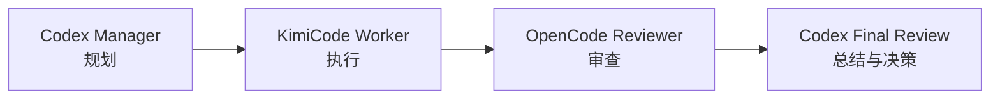

# AgentOS 项目结构与功能概览

> 计划 B 的执行工作台验收记录见 [`docs/acceptance/execution-workbench-final.md`](acceptance/execution-workbench-final.md)。

> 本文基于当前仓库整理，面向需要快速理解 AgentOS 架构、运行方式和已实现能力的开发者。

## 1. 项目定位

AgentOS 是一个本地多 Agent 调度平台。它把多个 CLI Agent 组织成可追踪的执行流程，并提供 Workspace、会话、运行记录、实时事件、文件变更、Artifact、项目记忆和用户偏好等能力。

核心设计目标：

- 在本地工作区内运行 Codex、KimiCode、OpenCode 等 CLI Agent。
- 将一次用户请求建模为可恢复、可审计的 `AgentRun`。
- 通过 SSE 将执行状态和公开输出实时推送到 Web 界面。
- 对 Agent 输出、文件变化、测试结果和运行日志进行持久化。
- 在不保存完整用户原文的前提下，逐步学习可复用的项目记忆与交互偏好。

## 2. 仓库结构

```text
agentos/
├─ apps/
│  ├─ server/                  # Express + SQLite 后端
│  │  └─ src/
│  │     ├─ index.ts           # 服务启动、路由挂载、恢复与 retention
│  │     ├─ routes/            # Workspace、会话、Run、Task、Git、Memory、Preference 等 API
│  │     ├─ services/          # 会话、记忆、偏好、Artifact、模型发现等领域服务
│  │     ├─ store/             # SQLite 主存储与 JSON 兼容存储
│  │     ├─ managers/          # Workspace 管理
│  │     └─ events/            # 统一 AgentEvent 与 EventBus
│  └─ web/                     # Next.js 前端
│     └─ src/
│        ├─ app/               # 页面入口
│        ├─ components/        # 聊天、Agent、Run、Memory、Preference 等组件
│        └─ lib/               # API、SSE、重连、状态、附件和交互逻辑
├─ packages/
│  ├─ shared/                  # 前后端共享类型与领域模型
│  └─ agent-core/              # CLI Agent 执行核心
│     └─ src/
│        ├─ executor.ts        # 进程启动、流式输出、超时、取消与日志
│        ├─ runner.ts          # 四阶段 Agent 流水线与 memory 上下文
│        ├─ conversationRunner.ts # 聊天/群聊运行器
│        ├─ adapters/           # Codex JSONL 与普通文本 CLI 适配器
│        ├─ parsers.ts          # Worker/Reviewer/Final Review 结果解析
│        ├─ config.ts            # Agent、CLI、模型与默认参数
│        ├─ workspaceChanges.ts  # Git 工作区快照与文件变更计算
│        └─ runtimeArgs.ts       # CLI 参数改写工具
├─ workspace/                  # Workspace 列表及兼容的任务 JSON 数据
├─ agent-memory/               # 项目级 Markdown 记忆文件
├─ docs/                       # 架构、安全、验收、设计与实施计划
├─ scripts/                    # E2E、运行时和验收脚本
├─ start-dev.ps1              # Windows 一键启动脚本
├─ pnpm-workspace.yaml        # pnpm monorepo 配置
└─ README.md                   # 快速启动说明
```

## 3. 核心模块职责

### 3.1 `packages/shared`

定义跨前后端共享的数据契约，包括：

- `Workspace`、`WorkspaceAgent`、`AgentProfile`。
- `Conversation`、`ConversationMessage`、`ConversationMember`。
- `AgentRun`、`AgentExecution`、`ExecutionEvent`、`AgentEvent`。
- `RuntimeArtifact`、`RunFileChange`、CLI 调用记录。
- `MemoryRecord`、`MemoryCandidate`、记忆使用记录。
- `PreferenceEvidence`、`PreferenceProjection`、偏好应用记录。
- Task、Agent 阶段、状态、日志和思考强度等枚举。

### 3.2 `packages/agent-core`

负责“如何执行 Agent”，与 Express 和 React 解耦。

#### CLI 执行器

`CLIExecutor` 支持：

- 根据 Agent 配置解析 CLI 命令、参数、模型和 thinking effort。
- spawn 子进程并分别处理 stdout/stderr。
- 通过适配器解析结构化 JSONL 或普通文本输出。
- inactivity timeout、最大执行时长、AbortSignal 取消。
- 记录安全的 CLI invocation、退出码、耗时和公开日志。
- 采集执行前后的 Git 工作区快照并生成 created/modified/deleted/renamed 变更。
- 在 `AGENTOS_FORCE_MOCK=true` 时使用确定性的 MockCLI，便于本地开发和验收。

#### Agent 流水线

标准任务流水线由四个阶段组成：



`AgentRunner` 会为每个阶段读取对应的 `agent-memory` 文件、拼接规则和前序输出，再调用 `CLIExecutor`。`ConversationAgentRunner` 则服务于单聊、群聊和等待用户补充信息的对话运行。

#### CLI 适配与解析

- `CodexAdapter`：识别 Codex 的结构化事件。
- `PlainTextAdapter`：为 KimiCode、OpenCode 或其他普通文本 CLI 提供降级解析。
- `AgentCliAdapterRegistry`：探测 CLI 能力并选择适配器。
- `redaction.ts`：对工具输入、输出和运行时文本做脱敏与长度限制。
- `parsers.ts`：提取 Worker evidence、Reviewer decision 和 Final decision。

### 3.3 `apps/server`

负责“如何组织和持久化 AgentOS 运行”。服务默认监听 `3000`，入口为 `src/index.ts`。

#### Workspace 与 Agent 管理

- 创建、导入、列出、删除和更新 Workspace。
- 在 Workspace 级别保存 Agent 名称、角色、系统提示词、权限、CLI 命令、模型和 thinking effort。
- 支持 Agent 启用/禁用、身份编辑和模型能力刷新。
- 通过 `CliModelDiscovery` 从 CLI、缓存或配置中发现模型与可用 thinking effort。

#### 会话与 Run

- 创建 direct conversation 或 group conversation。
- 群聊支持多个成员和唯一 leader。
- 保存用户、Agent、系统消息，以及每次运行的 `AgentRun`。
- 保存每个阶段的 `AgentExecution`、状态变化、公开事件、CLI 调用和文件变化。
- 支持取消、`waiting_user`、恢复同一 Run、失败恢复和服务重启后的中断 Run 恢复。
- `RunStreamRegistry` 提供 SSE 事件发布、cursor 重放和已完成 Run 的迟到订阅。

#### Task 流程

旧版 Task API 保留四阶段流水线，支持：

- 创建、列出和查看 Task。
- 通过 SSE 执行 Task，并推送 stage、thinking、status、done 事件。
- 记录每个阶段的 stdout、stderr、退出码、耗时和当前 Agent。
- 处理 review decision、review blocked、取消、失败和活动时间。
- JSON 存储采用单 Task 更新，避免并发请求用旧数组覆盖其他 Task。

#### Git API

提供 Workspace 级别的：

- `GET /git/status`
- `GET /git/diff`
- `GET /git/log`

Git 命令通过异步 `execFile` 执行，不阻塞 Express 事件循环。

#### Artifact 与可观测性

`RuntimeArtifactCollector` 和 `RuntimeArtifactService` 会保存：

- 执行期间修改或删除的文件快照。
- 与干净 Git baseline 的 diff。
- 测试命令产生的 report。
- 图片、公开运行日志和归一化 runtime event。
- Artifact 的原始路径、大小、MIME、SHA-256、来源 Run/Execution。

Artifact 路由对 workspace 所属关系、`isWithin`、`realpath`、文件大小和图片签名进行校验，防止路径穿越和越权读取。

#### Isolation Release（计划 D）

`WorktreeManager` 为 clean Git workspace 创建 execution 级 branch/path lease，并在服务启动时 reconcile。结束后 `WorktreeArtifactService` 生成 tracked patch、untracked tar 和 SHA-256 manifest；公开 API 只返回 `pathLabel`，清理必须经过 recovery bundle 验证和显式确认。`RuntimeEventBuffer` 对持久化侧输出做相邻合并并限制详细事件数量，Storage API 提供容量警告和 preview/apply retention token；系统默认不自动删除 Run/Artifact，只有用户确认与 preview selection 完全一致时才执行归档删除。

#### Memory 系统

Memory 由 Markdown 正文和 SQLite 元数据组成：

- `MemoryService`：创建、读取、更新、归档和删除记忆。
- `MemoryRetriever`：按 Workspace、类型、相关文件和查询词检索 active memory，并限制条数与字符预算。
- SQLite FTS5：为记忆搜索提供全文索引。
- `MemoryCandidateService`：从已完成 Run 中生成最多三条候选记忆。
- 候选必须显式 accept/reject，pending 候选不会注入 Prompt。
- reviewed candidate 按时间和每个 Workspace 的保留数量定期清理，pending 不自动删除。

#### 自适应偏好记忆

偏好系统由 `PreferenceObserver`、`PreferenceProjector`、`PreferenceResolver`、`PreferenceRules` 和 `PreferenceService` 组成：

- 从明确的用户指令、重复指令、纠正和成功沿用中学习偏好。
- 按 response detail、execution style、change scope、verification depth 等维度记录 evidence。
- 按 global/workspace scope 与 coding、planning、review 等 context 隔离。
- 通过 `observed → provisional → stable` 晋升，并支持 `dormant` 和冲突处理。
- 解析否定、组合语义和 plan-first 指令，避免把“不要太简洁”误学成 concise。
- 只注入有界、脱敏的偏好上下文，不把完整用户原文写入 evidence。
- 支持查看 evidence/projection、暂停学习、清除学习结果、sleep 单条 projection。
- successful_application evidence 有数量上限，避免长期无限增长。

### 3.4 `apps/web`

Next.js 前端提供完整的 Workspace 操作界面：

- Workspace 列表、新建/导入 Workspace。
- Agent 列表、角色与权限编辑、模型和 thinking effort 选择。
- 单 Agent 会话和群聊创建、重命名、删除、成员与 leader 管理。
- 聊天输入、图片附件预览/校验、发送队列、取消运行。
- SSE 实时显示排队、准备上下文、运行 CLI、流式回复、工具事件、完成/失败/等待用户。
- 自动重连、cursor 续传、指数退避和连接异常提示。
- 右侧 Execution Inspector、Run Details、Artifact Shelf、文件变化和公开事件。
- Memory Panel、Memory Candidate Queue、Preference Panel。
- 可调整工作区侧栏和会话历史栏宽度，并持久化主题与会话模型设置。
- Toast、表单校验、草稿恢复和错误分类等交互细节。

### 3.5 `apps/server/src/store`

存储分为两层：

| 存储 | 用途 |
|---|---|
| SQLite (`.agentos/agentos.sqlite`) | 会话、Run、Execution、事件、Artifact、Memory、Preference 等主数据 |
| JSON 文件 | Workspace 列表与兼容的 Task 数据；提供原子写入和旧版本迁移 |

`SqliteStore` 负责 schema 创建、迁移、外键级联和查询；`JsonFileStore` 负责 JSON fallback。默认部署仍保留旧 Workspace/Task 数据兼容路径。

## 4. 典型运行流程

### 单聊

1. Web 创建或选择 Workspace、Agent 和 Conversation。
2. 用户发送消息，前端 POST 到 `messages/stream`。
3. Server 创建 `AgentRun`，解析偏好和可用 Memory，建立 Execution。
4. `ConversationAgentRunner` 调用 `agent-core`，通过 SSE 推送公开事件。
5. Server 持久化消息、事件、CLI invocation、文件变化、Artifact 和 Run 状态。
6. Web 刷新或重连后，可通过 Run details 重新读取完整历史。

### 标准群聊

```text
Leader 规划 → Worker 执行 → Reviewer 审查 → Leader 汇总
```

群聊中的成员执行共享同一个 `runId`，但每个成员拥有独立的 Execution；最终结果、失败原因和审查结论统一落在 Run 上。

### Memory 与 Preference 生命周期

```text
完成 Run
  ├─ 检索并注入 active Memory
  ├─ 记录偏好 evidence 与 projection
  └─ 生成待审核 Memory Candidate
       ├─ accept → 写入正式 Markdown Memory
       └─ reject → 保留审计状态，不注入 Prompt
```

## 5. 数据与目录约定

- `workspace/workspaces.json`：Workspace 基础列表和兼容配置。
- `workspace/<workspace-id>/.agentos/tasks.json`：Task 数据。
- `<project-root>/.agentos/agentos.sqlite`：SQLite 主数据库。
- `<workspace-root>/.agentos/artifacts/`：Artifact 内容和元数据。
- `<workspace-root>/agent-memory/`：项目级 Markdown 记忆文件。
- `docs/`：架构标准、安全边界、验收记录、spec 和 plan。

## 6. 开发与验证

环境要求：Node.js `>= 22.5`、pnpm。

常用命令：

```powershell
# 安装依赖
pnpm.cmd install

# 启动 Mock 开发环境
./start-dev.ps1 -Mock

# 单独启动后端/前端
pnpm.cmd --filter @agentos/server run dev
pnpm.cmd --filter @agentos/web run dev

# 测试与构建
pnpm.cmd --filter @agentos/agent-core test
pnpm.cmd --filter @agentos/server test
pnpm.cmd --filter @agentos/web build
pnpm.cmd -r run build
```

真实 CLI 模式需要将 `codex`、`kimi`、`opencode` 放入 PATH，或通过以下变量指定：

```text
AGENTOS_CODEX_CLI
AGENTOS_KIMI_CLI
AGENTOS_OPENCODE_CLI
AGENTOS_KIMI_MODEL
AGENTOS_OPENCODE_MODEL
AGENTOS_FORCE_MOCK
AGENTOS_AGENT_TIMEOUT
PORT
NEXT_PUBLIC_API_URL
```

验收脚本位于 `scripts/`，涵盖真实 Codex runtime、Memory、偏好系统和完整 E2E 流程。

## 7. 当前边界

- AgentOS 是本地调度平台，不负责替用户托管外部 CLI 账号或模型服务。
- 真正执行某个 CLI 需要该命令可被解析；只有显式启用 Mock 才会使用 MockCLI。
- JSON Task 更新解决的是单个 AgentOS 服务进程内的读改写竞态，不是跨进程分布式锁。
- 偏好学习是 best-effort，不应阻塞主 Run 的成功或失败。
- Memory Candidate 必须人工审核，系统不会把 pending 候选直接当作正式记忆。
